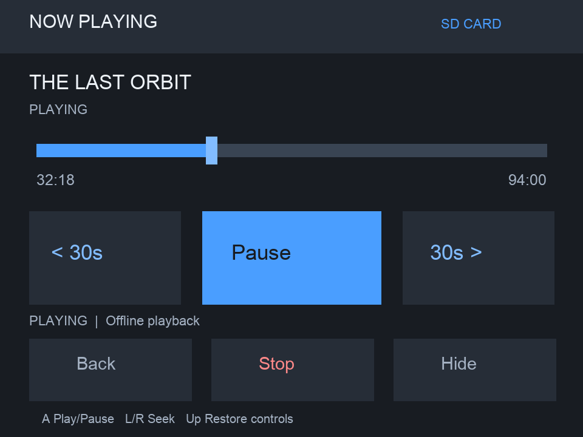

# Jellyfin Touch for Nintendo 3DS

An unofficial Jellyfin client for **New Nintendo 3DS and New Nintendo 2DS**, with a charcoal-gray and blue interface, touch playback controls, and offline downloads.

[Download the latest release](https://github.com/the-chilly/jellyfin-touch-3ds/releases/latest) · [Build and testing notes](docs/development.md)

> **Experimental:** ARM builds and host tests pass. Installation, playback, and SD-card behavior still need verification on a physical console.

## Features

- Browse movies, TV shows, and music with posters, descriptions, ratings, and other media information.
- Home shelves for Continue Watching, Movies, TV Shows, Music, and Recently Added.
- Touch tabs for Home, Library, Downloads, and Settings, plus search and library pagination.
- Verified HTTPS and saved server URL, username, and login token. Your password is never saved.
- Touch timeline, Pause/Play, and buttons to skip backward or forward 30 seconds.
- Download movies, episodes, and songs to SD with progress, transfer speed, and estimated time remaining.
- Resume downloaded media from a saved position, including after restarting the app.
- Animated loading indicators and cached artwork.
- HOME Menu installation through CIA, or Homebrew Launcher installation through 3DSX.

*Preview rendered from the app's drawing code. Console fonts and rendering may differ.*

## Installation

You need a **New 3DS or New 2DS with custom firmware**, a Jellyfin server, and your console's dumped DSP firmware at `/3ds/dspfirm.cdc` for audio. The server must allow transcoding and have a working FFmpeg installation.

### HOME Menu — CIA

1. Open the [latest release](https://github.com/the-chilly/jellyfin-touch-3ds/releases/latest).
2. On your console, open **FBI → Remote Install → Scan QR Code** and scan the release's install QR.
3. Launch **Jellyfin Touch** from the HOME Menu.

You can also copy `jellyfin-3ds.cia` to your SD card and install it through FBI. The CIA includes the public HTTPS certificate bundle.

### Homebrew Launcher — 3DSX

1. Download the SD package (`jellyfin-touch-3ds-…-sd.zip`) from the latest release.
2. Extract it and copy the `3ds/` folder to the root of your SD card.
3. Launch `jellyfin-3ds.3dsx` through the Homebrew Launcher.

Keep the executable and `cacert.pem` in `/3ds/jellyfin-3ds/`.

### Connect to Jellyfin

Select each login field with **Up/Down**, press **A** to open the keyboard, and enter your server URL, username, and password. Press **R** to connect.

Use your server's final address, including any reverse-proxy path—for example, `https://media.example.com/jellyfin`. Server redirects are rejected. HTTP is supported if explicitly entered.

Login details save automatically after a successful connection. Settings and downloads are shared between CIA and 3DSX installations in `/3ds/jellyfin-3ds/`. Back up this folder before replacing an existing installation. Sign out through **Settings → Logout**.

## Controls

| Screen | Controls |
| --- | --- |
| Login | Up/Down: select field · A: keyboard · R: connect |
| Home | Touch/D-pad: select titles and shelves · A: information · X: full libraries · Y: search · L: refresh |
| Browse | Touch/D-pad: select · A: information/open · B: back · L/R: pages · Y: search · X: download |
| Information | Up/Down: scroll description · A: resume/play or open episodes/tracks · X: play from beginning · Y: download · B: back |
| Downloads | A/touch: play or resume offline · Y: play from beginning · X/touch: delete |
| Playback | Touch timeline: seek · A: pause/play · L/R: skip 30 seconds · X: stop · B: return to browsing |
| Playback | Touch buttons: Back, Stop, Hide · Down: hide controls · Up: show controls |
| Navigation | Touch bottom tabs · SELECT: Settings · ZR: current playback from Home/Browse |
| Anywhere | START: exit |

Drag the timeline to preview a position, then release to seek. Streaming seeks may need buffering. Seeking is unavailable when the duration is unknown.

## Downloads and offline resume

Download from a title's information screen or while browsing. Saved media appears in **Downloads**, with its file size and offline playback controls. Movies and episodes use H.264/AAC video; songs use MP3.

Resume positions save about every five seconds and when you pause, seek, stop, leave playback, or exit. **Y** starts from the beginning. Finishing near the end clears the bookmark. Offline playback does not update Jellyfin's watched state.

Keep the console awake while downloading. **B** cancels a transfer. Downloads run one at a time; there is no queue or interrupted-download resume. Each file is limited to **3.75 GiB**, with up to **50 saved titles per server/account**. Estimated sizes and remaining times may change during transcoding.

If the remembered server is unavailable at startup, the app opens saved downloads after the connection attempt. Previously cached posters remain available offline; uncached artwork shows a title placeholder.

## Updates

| Installation | How to update |
| --- | --- |
| CIA | Install the latest CIA through FBI using the new release QR. Settings → Update displays these instructions. |
| 3DSX | Select Settings → Update to check, then select it again to install a newer version. Exit and reopen afterward. B cancels. |

The 3DSX updater verifies the download's SHA-256 hash, size, and file header, and keeps the previous executable as `jellyfin-3ds.3dsx.bak`. Use the standard `/3ds/jellyfin-3ds/jellyfin-3ds.3dsx` path. Updates preserve settings and downloads.

## HTTPS and troubleshooting

- **Public HTTPS:** the CIA includes trusted certificates. The 3DSX uses the `cacert.pem` included in the SD package.
- **Private CA/self-signed server:** add your trusted PEM CA certificate to `/3ds/jellyfin-3ds/cacert.pem`. An SD bundle takes precedence over the CIA's bundled certificates.
- **Certificate errors:** check the console's date/time and use the hostname covered by your certificate. Certificate verification stays enabled.
- **Stalled artwork or information:** press **L** to refresh. Failed requests retry automatically; missing metadata depends on your Jellyfin library.
- **Persistent loading or exit problems:** reproduce the issue and copy `/3ds/jellyfin-3ds/debug.log` before launching again. Each launch resets the log.

The public certificate bundle comes from [curl's Mozilla CA extract](https://curl.se/docs/caextract.html).

## Limitations

Video targets the New 3DS hardware decoder. Old 3DS video and subtitle selection are not supported by this adaptation. Long transcodes, repeated seeking, audio/video synchronization, HOME Menu exit, and offline playback still require real-console testing.

For build instructions, verification details, and the offline test procedure, see [development notes](docs/development.md).

## Credits and license

Based on [bogocat/jellyfin-3ds](https://github.com/bogocat/jellyfin-3ds), with the original implementation and contributor credits preserved. This project is unofficial and is not affiliated with Jellyfin or Nintendo.

Built with devkitPro/libctru, citro2d/citro3d, curl/mbedTLS, cJSON, FFmpeg/ThirdTube, mpg123, Opus, Vorbis, and stb_image. Upstream also credits Switchfin and Video player for 3DS as implementation references.

Licensed under [GPL-3.0](LICENSE).
